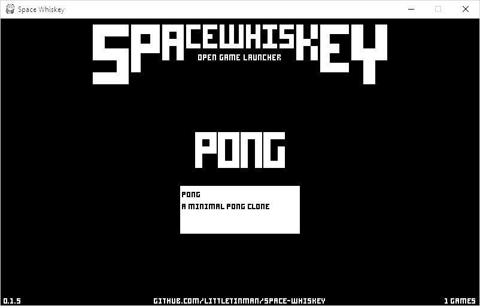

# Space Whiskey
An Open Game Launcher



## What is Space Whiskey
Space Whiskey is a game launcher for the Raspberry Pi and other systems.
It is designed to allow you to browse your games easily with only the addition of a simple config file.

## How it Works
- Looks in the Games folder of the current user
- Looks in each folder for a metadata.json file
- Looks in the Games folder for a library.json file for external games and directories
- Lists the games in a minimal user interface
- Provides a simple way to launch any of the games

## Goals
- Use no libraries other than pygame
- Work on 2.7 and 3.6
- Be B&W in order to draw attention to the games

## Sample config.json
This file goes in the src folder of Space Whiskey but is not required:
```
{
    "fullscreen": false,
    "logfile": log.log
}
```

## Sample metadata.json
This file should be included in your game directory:
```
{
  "title": "My Game",
  "description": "A great game",
  "image": "200x120-image-for-game.png*",
  "command": "start command for game"
}
```

## Sample Game
You can see a sample metadata setup or test your installation with the following repo: https://github.com/littletinman/space-whiskey-pong

## Sample library.json
This file should go in the /Games directory of your user
```
{
  "games": [
    {
      "title": "My Game 1",
      "description": "A great game",
      "image": null or absolute path*,
      "command": "game executable"
    }
  ],
  "directories": ["absolute/path/to/game/directory"]
}
```

## Install
1. Download Repo
2. Install python and pygame
3. Add games to ```/Games``` or add directories to ```/Games/library.json```
4. Run ```python space-whiskey.py```

## Linux Install
1. Download Repo - ```git clone https://github.com/littletnman/space-whiskey.git```
2. Install pygame, choose one of following options\
  a. Use pip - ```pip install pygame```\
  b. Debian/Ubuntu - ```sudo apt-get install python3-pygame```\
  c. Fedora - ```sudo yum install python3-pygame```
3. Test pygame installation - ```python3 -m pygame.examples.aliens```
4. Add games to ```/Games``` or add directories to ```/Games/library.json```
5. Run ```python space-whiskey.py```
